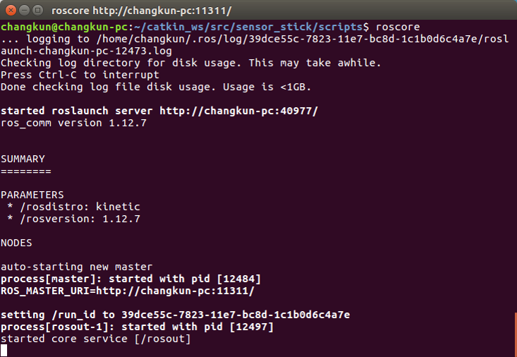
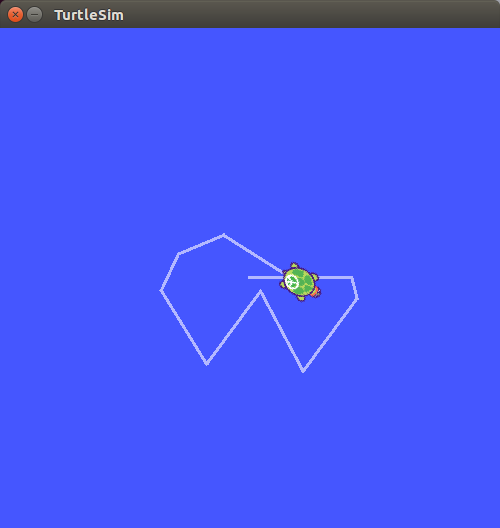

# 1.4 安装ROS的步骤

## 1.4.1 ROS版本选择
ROS目前只支持在Linux系统上安装部署，它的首选开发平台是Ubuntu。时至今日ROS已经相继更新推出了多种版本，供不同版本的Ubuntu开发者使用。为了提供最稳定的开发环境，ROS的每个版本都有一个推荐运行的Ubuntu版本。如下表所示：


|    ROS 版本    | 首选Ubuntu版本 |
| :------:   | :------:           |
| **Melodic(建议选用)**  | **Ubuntu 18.04** |
| Lunar      |   Ubuntu 17.04 |
| Kinetic   |  Ubuntu 16.04  |
| Jade       |  Ubuntu 15.04  |
| Indigo     |  Ubuntu 14.04  |
| ...        |  ...           |

本教程使用的平台是**Ubuntu 18.04**，ROS版本是**Melodic**。

如果你还没有安装Ubuntu，建议选择18.04版本(https://www.ubuntu.com/download/desktop )。并且我们建议在本地安装，不推荐用虚拟机，这样兼容性更好。

如果你已经安装Ubuntu，请确定系统版本，在终端中输入`cat /etc/issue`确定Ubuntu版本号，然后选择对应的ROS版本。如果没有安装正确的ROS版本，就会出现各种各样的依赖错误，所以安装时请谨慎。

更多信息请参考[ROS官方网站](http://www.ros.org/)进行下载和安装。

## 1.4.2 安装ROS

在正式的安装前，先检查下Ubuntu初始环境是否配置正确。

打开`Ubuntu的设置`->`软件与更新`->`Ubuntu软件`->勾选关键字`universe`,`restricted`,`multiverse`三项。
如图所示:


配置完成后，就可以开始安装ROS了，打开终端。


### ① 添加sources.list

	$ sudo sh -c '. /etc/lsb-release && echo "deb http://mirrors.ustc.edu.cn/ros/ubuntu/ $DISTRIB_CODENAME main" > /etc/apt/sources.list.d/ros-latest.list'

这一步配置将镜像添加到Ubuntu系统源列表中，建议使用国内或镜像源，这样能够保证下载速度。本例使用的是中国科技大学的源。

### ② 添加keys

	$ sudo apt-key adv --keyserver 'hkp://keyserver.ubuntu.com:80' --recv-key C1CF6E31E6BADE8868B172B4F42ED6FBAB17C654

公钥是Ubuntu系统的一种安全机制，也是ROS安装中不可缺的一部分。

### ③ 系统更新

	$ sudo apt-get update && sudo apt-get upgrade

更新系统，确保自己的Debian软件包和索引是最新的。

### ④ 安装ROS

ROS中有很多函数库和工具，官网提供了四种默认的安装方式，当然也可以单独安装某个特定的软件包。这四种方式包括桌面完整版安装、桌面版安装，基础版安装、单独软件包安装。推荐安装桌面完整版安装（包含ROS、rqt、rviz、通用机器人函数库、2D/3D仿真器、导航以及2D/3D感知功能），如下：

* Ubuntu 18.04安装melodic版本

		$ sudo apt install ros-melodic-desktop-full # Ubuntu 18.04

* Ubuntu 16.04安装Kinetic版本

		$ sudo apt-get install ros-kinetic-desktop-full # Ubuntu 16.04

* Ubuntu 14.04安装Lndigo版本

		$ sudo apt-get install ros-indigo-desktop-full # Ubuntu 14.04

如果你不想安装桌面完整版，你还可以尝试以下三种方式安装：

* 桌面版安装（包含ROS、rqt、rviz以及通用机器人函数库）

		$ sudo apt install ros-melodic-desktop

* 基础版安装（包含ROS核心软件包、构建工具以及通信相关的程序库，无GUI工具）

		$ sudo apt install ros-melodic-ros-base

* **单独软件包安装（这种安装方式在运行ROS缺少某些package依赖时会经常用到。你可以安装某个指定的ROS软件包,使用软件包名称替换掉下面的PACKAGE）**

		$ sudo apt install ros-melodic-PACKAGE

    例如系统提示找不到actionlib，你就可以：

		$ sudo apt install ros-melodic-actionlib

注意：时间2019-07-15，melodic版本中没有发布slam-gmapping软件包，如果执行sudo apt install ros-melodic-slam-gmapping会报如下错误：
``` bash
正在读取软件包列表... 完成
正在分析软件包的依赖关系树       
正在读取状态信息... 完成       
E: 无法定位软件包 ros-melodic-slam-gmapping
```

	要查找可用的软件包，请运行：

		$ apt search ros-melodic


软件包的依赖问题还可能出现在重复安装ROS、错误安装软件包的过程中，出现有一些软件包无法安装，例如：
```bash
下列软件包有未满足的依赖关系：ros-melodic-desktop-full : 
依赖: ros-melodic-desktop 但是它将不会被安装；
依赖: ros-melodic-perception 但是它将不会被安装；
依赖: ros-melodic-simulators 但是它将不会被安装；
E: 无法修正错误，因为您要求某些软件包保持现状，就是它们破坏了软件包间的依赖关系。
```
出现上述问题，有可能是自己的版本不合适不兼容造成，也可能是镜像源没有更新，具体的设置参考软件和更新的截图。当然也有可能是其他原因，比如更新了忘记刷新环境source一下，重开一个终端等等。具体的问题原因可以去搜索引擎上尝试求助解决，或者登陆[ROS Wiki](http://wiki.ros.org/ROS/)(ROS的百科全书)去查询解决自己的具体问题。


## 1.4.3 配置ROS
配置ROS是安装完ROS之后必须的工作。

### ① 初始化rosdep

	$ sudo rosdep init && rosdep update

这一步初始化rosdep，是使用ROS之前的必要一步。rosdep可以方便在你需要编译某些源码的时候为其安装一些系统依赖，同时也是某些ROS核心功能组件所必需用到的工具。

### ② ROS环境配置
	#For Ubuntu 18.04
	$ echo "source /opt/ros/melodic/setup.bash" >> ~/.bashrc && source ~/.bashrc

	#For Ubuntu 16.04
	$ echo "source /opt/ros/kinetic/setup.bash" >> ~/.bashrc && source ~/.bashrc

	#For Ubuntu 14.04
	$ echo "source /opt/ros/indigo/setup.bash" >> ~/.bashrc && source ~/.bashrc

**注意：** ROS的环境配置，使得你每次打开一个新的终端，ROS的环境变量都能够自动配置好，也就是添加到bash会话中，因为命令`source /opt/ros/melodic/setup.bash`
只在当前终端有作用，即具有单一时效性，要想每次新开一个终端都不用重新配置环境，就用echo语句将命令添加到bash会话中。

### ③ 安装rosinstall

[rosinstall](http://wiki.ros.org/rosinstall) 是ROS中一个独立分开的常用命令行工具，它可以方便让你通过一条命令就可以给某个ROS软件包下载很多源码树。在ubuntu上安装此工具和其他依赖项以构建ROS包，请运行：

	$ sudo apt install python-rosinstall python-rosinstall-generator python -wstool build-essential


至此，ROS的安装就结束了，下面测试ROS能否正常运行。

## 1.4.4 测试ROS

首先启动ROS，输入代码运行roscore：

	$ roscore

如果出现下图所示，那么说明ROS正常启动了！



接着我们测试ROS的吉祥物--小海龟，来简单的测试ROS运行是否正常，同时也来体验一下ROS的神奇与精彩！

启动roscore后，重新打开一个终端窗口，输入：

	$ rosrun turtlesim turtlesim_node

你还看到一只萌萌的海龟出现在屏幕上，那么该怎么样来操纵这只小海龟呢？重新打开新的一个终端,输入:

	$ rosrun turtlesim  turtle_teleop_key

将鼠标聚焦在第三个终端窗口上，然后通过键盘上的方向键，进行操作小海龟，如果小海龟正常移动，并且在屏幕上留下自己的移动轨迹，如下图。恭喜你，ROS已经成功的安装、配置并且运行！



至此，ROS的安装、配置与测试就全部结束了，下面就正式开启ROS精彩的旅程！
